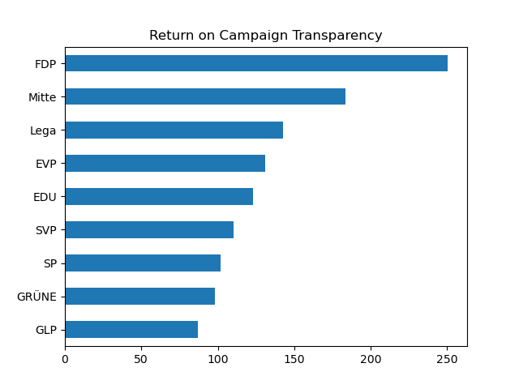

# Return on Campaign Transparency

This project is a basic template to dig into the data from the #moneyinpolitics project.

Shows a "Centimes per Vote" rating of the available campaign transparency data (income and expenses) aggregated by [moneyinpolitics.ch](https://moneyinpolitics.ch) - as compared to the total number of votes from [opendata.swiss](https://opendata.swiss/de/dataset/eidg-wahlen-2023). See [Python Notebook](ReturnOnElections.ipynb) for details.

Discuss at [forum.opendata.ch](https://forum.opendata.ch/t/swiss-elections-2023-moneyinpolitics/922)

Challenge it at [DINAcon 2023](https://hacknight.dinacon.ch/project/72)
